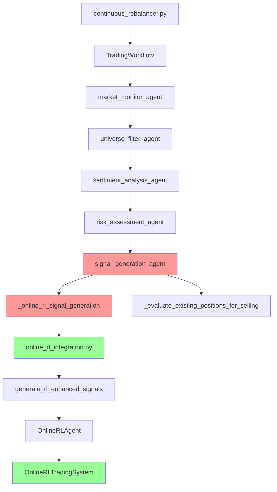
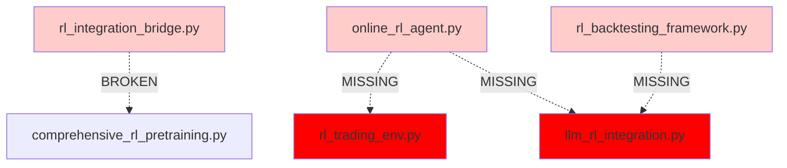
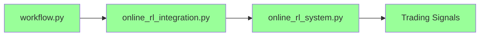

# ML Agent Architecture Analysis Report

**Date**: 2025-08-12  
**System**: RL-Enhanced Trading System

## Executive Summary

After comprehensive analysis of the trading system's ML agent architecture, I've identified **significant architectural redundancy** and **broken dependencies** that are causing the current error. The system has **three overlapping RL implementations** that need immediate consolidation.

## Current Architecture Map

### Active Execution Path (What Actually Runs)



### Broken Dependencies (Dead Code)



## Detailed Analysis

### 1. Actually Used Agents (Runtime Active)

#### **Primary RL System** - ✅ WORKING
- **File**: `agents/online_rl_integration.py`
- **Entry Point**: `generate_rl_enhanced_signals()`
- **Called From**: `workflow.py:_online_rl_signal_generation()`
- **Status**: ✅ Active, functioning
- **Purpose**: Main RL signal generation using dual-agent architecture

#### **Core RL Engine** - ✅ WORKING  
- **File**: `agents/online_rl_system.py`
- **Class**: `OnlineRLTradingSystem`
- **Called From**: `online_rl_integration.py`
- **Status**: ✅ Active, core engine
- **Purpose**: Dual-agent RL system with stable/learner policies

#### **Workflow Orchestration** - ✅ WORKING
- **File**: `agents/workflow.py`
- **Classes**: `TradingWorkflow` (9 agent methods)
- **Called From**: `continuous_rebalancer.py`
- **Status**: ✅ Active, main orchestrator
- **Purpose**: LangGraph-based trading workflow

### 2. Dead Code / Unused Agents

#### **Legacy RL Bridge** - ❌ DEAD CODE
- **File**: `agents/rl_integration_bridge.py`
- **Dependencies**: `comprehensive_rl_pretraining.py`
- **Usage**: Never called in main execution path
- **Status**: ❌ Dead code, can be removed
- **Impact**: No impact on current functionality

#### **Standalone RL Agent** - ❌ BROKEN
- **File**: `agents/online_rl_agent.py`
- **Missing Dependencies**: 
  - `agents.rl_trading_env` (doesn't exist)
  - `agents.llm_rl_integration` (doesn't exist)
- **Usage**: Never called in main execution path
- **Status**: ❌ Broken imports, dead code
- **Impact**: No impact on current functionality

#### **Backtesting Framework** - ❌ BROKEN
- **File**: `agents/rl_backtesting_framework.py`
- **Missing Dependencies**: 
  - `agents.llm_rl_integration` (doesn't exist)
  - `agents.rl_trading_env` (doesn't exist)
- **Usage**: Never called in main execution path
- **Status**: ❌ Broken imports, dev/test only
- **Impact**: Testing functionality impacted

#### **Sentiment Agent** - ⚠️ INDIRECT USE
- **File**: `agents/sentiment_agent.py`
- **Usage**: Imported by other core modules but not directly by workflow
- **Status**: ⚠️ Potentially used indirectly
- **Impact**: May be needed by core modules

### 3. Missing Files Causing Import Errors

#### **Critical Missing Files**:
1. `agents/rl_trading_env.py` - Referenced by 2 files
2. `agents/llm_rl_integration.py` - Referenced by 3 files

#### **Impact**: 
- No runtime impact (files not in execution path)
- Prevents import of broken modules
- May cause issues if those modules are imported elsewhere

## Current Error Root Cause

```
2025-08-12 12:40:54,768 - agents.workflow - ERROR - ❌ CRITICAL: RL signal generation failed and no fallback allowed
```

### Analysis:
- **Location**: `workflow.py:signal_generation_agent()`
- **Flow**: `signal_generation_agent()` → `_online_rl_signal_generation()` → `generate_rl_enhanced_signals()`
- **Issue**: RL system likely failing to initialize or generate signals
- **NOT caused by**: Missing import files (they're not in execution path)

## Configuration Analysis

### RL Settings Active:
```python
# From config/settings.py
max_position_size: float = 0.35          # 35% max position
target_portfolio_size: int = 35          # Target 35 stocks  
min_portfolio_size: int = 25             # Min 25 stocks
max_portfolio_size: int = 50             # Max 50 stocks
```

### No Agent Enable/Disable Flags:
- All agents in workflow are always enabled
- No configuration switches to disable specific agents
- System assumes all agents will function

## Recommendations

### 1. Immediate Actions (Fix Current Error)

#### **Priority 1**: Debug Active RL System
- Focus on `online_rl_integration.py` and `online_rl_system.py`
- Add detailed logging to `generate_rl_enhanced_signals()`
- Check initialization of `OnlineRLTradingSystem`
- Verify market data format compatibility

#### **Priority 2**: Remove Dead Code
```bash
# Safe to remove (not in execution path):
rm agents/rl_integration_bridge.py
rm agents/online_rl_agent.py  
rm agents/rl_backtesting_framework.py
```

### 2. Architecture Consolidation

#### **Single RL Path Strategy**:


#### **Benefits**:
- Eliminates 3 redundant RL implementations
- Reduces maintenance overhead
- Clearer execution path
- Faster debugging

### 3. Enhanced Architecture

#### **Keep and Enhance**:
- `agents/online_rl_integration.py` (main interface)
- `agents/online_rl_system.py` (core engine)
- `agents/workflow.py` (orchestration)
- `agents/unified_reward_calculator.py` (supporting)

#### **Optional Enhancements**:
- Add configuration flags for agent enable/disable
- Implement fallback mechanisms for RL failures
- Add comprehensive unit tests for RL components

## File-by-File Recommendations

| File | Status | Action | Justification |
|------|--------|--------|---------------|
| `workflow.py` | ✅ Keep | Enhance error handling | Core orchestrator |
| `online_rl_integration.py` | ✅ Keep | Debug current issues | Main RL interface |
| `online_rl_system.py` | ✅ Keep | Verify functionality | Core RL engine |
| `rl_integration_bridge.py` | ❌ Remove | Dead code | Never called |
| `online_rl_agent.py` | ❌ Remove | Broken imports | Never called |
| `rl_backtesting_framework.py` | ⚠️ Fix or Remove | For testing only | Broken imports |
| `sentiment_agent.py` | ⚠️ Keep | May be used indirectly | Potential dependency |
| `comprehensive_rl_pretraining.py` | ❌ Remove | Unused | Not in execution path |

## Implementation Priority

### Phase 1: Emergency Fix (Hours)
1. Debug `generate_rl_enhanced_signals()` function
2. Add detailed error logging
3. Implement temporary fallback mechanism

### Phase 2: Cleanup (Days)  
1. Remove dead code files
2. Fix remaining import errors
3. Add unit tests for RL components

### Phase 3: Enhancement (Weeks)
1. Add agent configuration management
2. Implement comprehensive monitoring
3. Design proper fallback strategies

## Conclusion

The trading system has a **clean, working RL architecture** in `online_rl_integration.py` + `online_rl_system.py`, but it's obscured by **significant dead code** from previous implementations. The current error is likely in the working RL system itself, not the architectural design.

**Immediate focus should be on debugging the active RL pipeline rather than architectural changes.**