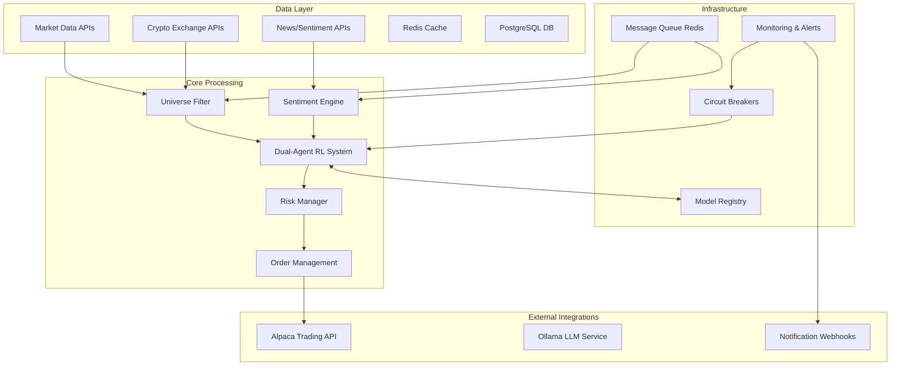

# Production RL Trading System Architecture

## Overview
This document outlines the production-ready architecture for the RL-based algorithmic trading system, designed for high availability, low latency, and regulatory compliance.

## Architecture Components



## Critical Production Requirements

### 1. **Latency Requirements**
- **RL Inference**: < 50ms P99
- **Market Data Processing**: < 100ms end-to-end
- **Order Execution**: < 200ms from signal to order placement
- **Sentiment Analysis**: < 30 seconds (can be asynchronous)

### 2. **Reliability & Safety**
```yaml
safety_constraints:
  max_drawdown: 0.08          # 8% maximum portfolio drawdown
  position_size_limit: 0.15   # 15% max single position
  daily_loss_limit: 0.05      # 5% daily loss circuit breaker
  consecutive_failures: 3     # Max failures before halt
  
circuit_breakers:
  api_failure_threshold: 5    # API failures before circuit open
  model_drift_threshold: 0.15 # Model confidence drop threshold
  latency_threshold_ms: 200   # Max acceptable system latency
```

### 3. **Data Pipeline Architecture**

```python
# Production data flow design
class ProductionDataPipeline:
    async def process_market_event(self, event: MarketDataEvent):
        # Stage 1: Validation & Enrichment (< 10ms)
        validated_event = await self.validate_and_enrich(event)
        
        # Stage 2: Feature Engineering (< 20ms)
        features = await self.extract_features(validated_event)
        
        # Stage 3: RL Inference (< 50ms)
        action = await self.rl_inference(features)
        
        # Stage 4: Risk Validation (< 10ms)
        safe_action = await self.risk_filter(action, validated_event)
        
        # Stage 5: Order Generation (< 20ms)
        if safe_action:
            await self.generate_order(safe_action, validated_event)
        
        # Total Budget: < 110ms end-to-end
```

## Message Schemas

### Market Data Events
```json
{
  "event_type": "market_data",
  "timestamp": "2025-08-11T12:34:56.789Z",
  "symbol": "AAPL",
  "data": {
    "price": 150.25,
    "volume": 1000000,
    "bid": 150.20,
    "ask": 150.30,
    "volatility": 0.025
  },
  "metadata": {
    "source": "alpaca",
    "quality_score": 0.98,
    "sequence_id": 12345
  }
}
```

### RL Action Events
```json
{
  "event_type": "rl_action",
  "timestamp": "2025-08-11T12:34:57.123Z",
  "agent_id": "stable_agent_v1.2.3",
  "symbol": "AAPL",
  "action": {
    "allocation_weight": 0.05,
    "confidence": 0.87,
    "reasoning": "Positive sentiment + technical breakout",
    "regime": "bull_low_vol"
  },
  "metadata": {
    "model_version": "v1.2.3",
    "inference_time_ms": 45.2,
    "uncertainty_estimate": 0.12
  }
}
```

## Infrastructure Components

### Redis Configuration
```yaml
# Redis for caching and message queuing
redis:
  maxmemory: 4gb
  maxmemory-policy: allkeys-lru
  save: "900 1"  # Save if at least 1 key changed in 900 seconds
  
  # Trading-specific configurations
  streams:
    market_data: "market_data_stream"
    rl_actions: "rl_actions_stream" 
    alerts: "alerts_stream"
    
  cache_ttls:
    market_data: 60      # 1 minute
    sentiment_data: 3600 # 1 hour
    model_cache: 86400   # 24 hours
```

### Model Registry Schema
```python
@dataclass
class ModelVersion:
    version: str
    timestamp: datetime
    performance_metrics: Dict[str, float]
    training_config: Dict[str, Any]
    validation_results: Dict[str, float]
    deployment_status: str  # "active", "canary", "deprecated"
    
    # Performance requirements for production deployment
    required_metrics = {
        'sharpe_ratio': 1.5,
        'max_drawdown': 0.08,
        'win_rate': 0.55,
        'profit_factor': 1.3
    }
```

## Deployment Strategy

### 1. **Canary Deployment**
```yaml
deployment_stages:
  1_model_validation:
    duration: "24h"
    traffic_percentage: 0%
    validation_mode: "shadow"
    
  2_canary_deployment:
    duration: "48h" 
    traffic_percentage: 10%
    monitoring_metrics: ["latency", "accuracy", "safety_violations"]
    
  3_gradual_rollout:
    duration: "72h"
    traffic_percentage: [25%, 50%, 100%]
    rollback_triggers: ["error_rate > 2%", "latency_p99 > 100ms"]
    
  4_full_deployment:
    monitoring_duration: "7d"
    success_criteria: ["no_safety_violations", "performance_stable"]
```

### 2. **Docker Production Setup**
```dockerfile
# Production Dockerfile
FROM python:3.11-slim

# Install system dependencies
RUN apt-get update && apt-get install -y \
    build-essential \
    curl \
    && rm -rf /var/lib/apt/lists/*

# Install Python dependencies
COPY requirements.txt .
RUN pip install --no-cache-dir -r requirements.txt

# Copy application
COPY . /app
WORKDIR /app

# Production configuration
ENV PYTHONPATH=/app
ENV TRADING_MODE=paper
ENV LOG_LEVEL=INFO

# Health check
HEALTHCHECK --interval=30s --timeout=10s --retries=3 \
  CMD python -c "import requests; requests.get('http://localhost:8000/health')"

EXPOSE 8000
CMD ["python", "-m", "uvicorn", "main:app", "--host", "0.0.0.0", "--port", "8000"]
```

### 3. **Kubernetes Production Manifest**
```yaml
apiVersion: apps/v1
kind: Deployment
metadata:
  name: rl-trading-system
spec:
  replicas: 2
  strategy:
    type: RollingUpdate
    rollingUpdate:
      maxUnavailable: 0
      maxSurge: 1
  
  template:
    spec:
      containers:
      - name: trading-system
        image: rl-trading:latest
        resources:
          requests:
            cpu: "2"
            memory: "4Gi"
          limits:
            cpu: "4"
            memory: "8Gi"
        
        env:
        - name: REDIS_URL
          value: "redis://redis:6379"
        - name: TRADING_MODE
          value: "paper"
          
        livenessProbe:
          httpGet:
            path: /health
            port: 8000
          initialDelaySeconds: 30
          periodSeconds: 10
          
        readinessProbe:
          httpGet:
            path: /ready
            port: 8000
          initialDelaySeconds: 5
          periodSeconds: 5
```

## Monitoring & Observability

### Key Metrics
```python
PRODUCTION_METRICS = {
    # Performance Metrics
    'inference_latency_p99_ms': {'threshold': 100, 'alert': 'critical'},
    'data_pipeline_latency_ms': {'threshold': 200, 'alert': 'warning'}, 
    'order_execution_latency_ms': {'threshold': 500, 'alert': 'critical'},
    
    # Trading Metrics  
    'portfolio_drawdown_pct': {'threshold': 8.0, 'alert': 'critical'},
    'daily_pnl_volatility': {'threshold': 0.05, 'alert': 'warning'},
    'position_concentration_max': {'threshold': 0.15, 'alert': 'warning'},
    
    # System Health
    'cpu_usage_pct': {'threshold': 80, 'alert': 'warning'},
    'memory_usage_pct': {'threshold': 85, 'alert': 'critical'},
    'error_rate_pct': {'threshold': 1.0, 'alert': 'warning'},
    
    # Model Performance
    'model_confidence_avg': {'threshold': 0.7, 'alert': 'warning'},
    'prediction_accuracy_7d': {'threshold': 0.55, 'alert': 'warning'},
    'model_drift_score': {'threshold': 0.15, 'alert': 'critical'}
}
```

### Alerting Rules
```yaml
alerts:
  critical:
    - inference_latency_p99 > 100ms for 5min
    - portfolio_drawdown > 8% 
    - consecutive_order_failures > 3
    - model_confidence < 0.5 for 1h
    
  warning:
    - cpu_usage > 80% for 10min
    - memory_usage > 85% for 5min  
    - error_rate > 1% for 15min
    - data_staleness > 2min
```

## Security & Compliance

### API Security
```python
SECURITY_CONFIG = {
    'api_keys': {
        'rotation_policy': '90d',
        'storage': 'vault',  # HashiCorp Vault
        'encryption': 'AES-256'
    },
    'network': {
        'tls_version': '1.3',
        'certificate_rotation': '30d',
        'ip_whitelist': ['production_subnets']
    },
    'audit_logging': {
        'all_trades': True,
        'model_predictions': True, 
        'safety_violations': True,
        'retention_days': 2555  # 7 years for compliance
    }
}
```

## Disaster Recovery

### Backup Strategy
```yaml
backup_config:
  models:
    frequency: "daily"
    retention: "90d"
    storage: "s3://rl-trading-backups/models/"
    
  portfolio_state:
    frequency: "hourly"
    retention: "30d"
    storage: "s3://rl-trading-backups/portfolio/"
    
  configuration:
    frequency: "on_change"
    retention: "1y"
    storage: "git_repository"
```

### Failover Plan
1. **Detection**: Automated health checks detect system failure
2. **Immediate Actions**: 
   - Cancel all open orders
   - Switch to safe-mode portfolio management
   - Alert on-call engineers
3. **Recovery**:
   - Spin up backup infrastructure
   - Restore latest model and portfolio state
   - Resume trading in paper mode for validation
4. **Validation**: 24-hour paper trading validation before live resume

## Performance Benchmarks

| Component | Target Latency | P95 Latency | P99 Latency |
|-----------|----------------|-------------|-------------|
| RL Inference | 30ms | 45ms | 75ms |
| Risk Validation | 5ms | 8ms | 15ms |
| Order Placement | 100ms | 150ms | 250ms |
| End-to-End Pipeline | 150ms | 200ms | 350ms |

## Cost Optimization

### Infrastructure Sizing
```yaml
production_sizing:
  compute:
    cpu_cores: 8
    memory_gb: 16
    storage_gb: 100
    gpu: "optional T4 for inference acceleration"
    
  estimated_costs:
    aws_monthly: "$400-600"
    data_feeds: "$200-500" 
    monitoring: "$50-100"
    total_monthly: "$650-1200"
```

This production architecture ensures:
- ✅ **Low latency**: Sub-100ms decision loops
- ✅ **High availability**: 99.9% uptime target
- ✅ **Safety first**: Multiple circuit breakers and risk controls
- ✅ **Scalability**: Horizontal scaling for increased throughput
- ✅ **Observability**: Comprehensive monitoring and alerting
- ✅ **Compliance**: Full audit trails and security controls