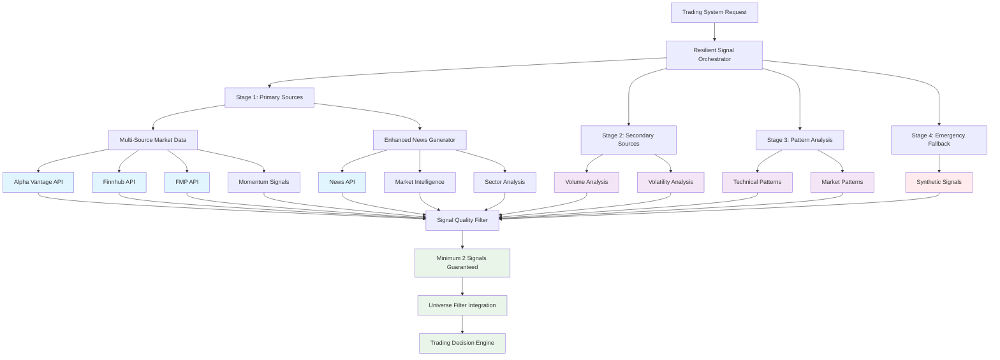
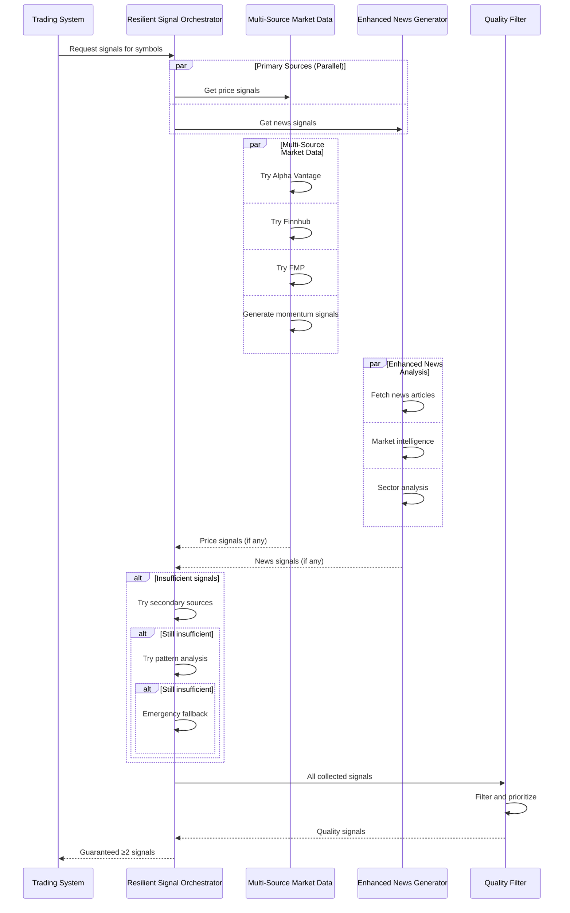
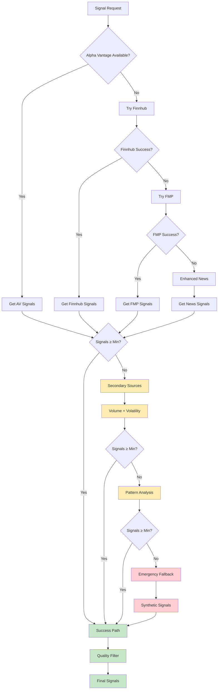
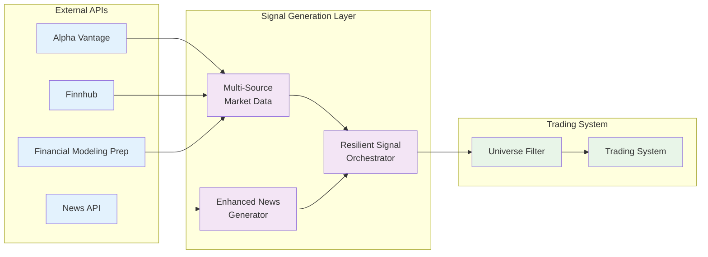

# Signal Generation Architecture

## High-Level Architecture Diagram

```mermaid
graph TB
    %% Input Layer
    A[Trading System Request] --> B[Resilient Signal Orchestrator]
    
    %% Orchestration Layer
    B --> C[Stage 1: Primary Sources]
    B --> D[Stage 2: Secondary Sources]
    B --> E[Stage 3: Pattern Analysis]
    B --> F[Stage 4: Emergency Fallback]
    
    %% Primary Sources (Parallel)
    C --> G[Multi-Source Market Data]
    C --> H[Enhanced News Generator]
    
    %% Multi-Source Market Data
    G --> I[Alpha Vantage API]
    G --> J[Finnhub API]
    G --> K[FMP API]
    G --> L[Momentum Signals]
    
    %% Enhanced News Generator
    H --> M[News API]
    H --> N[Market Intelligence]
    H --> O[Sector Analysis]
    
    %% Secondary Sources
    D --> P[Volume Analysis]
    D --> Q[Volatility Analysis]
    
    %% Pattern Analysis
    E --> R[Technical Patterns]
    E --> S[Market Patterns]
    
    %% Emergency Fallback
    F --> T[Synthetic Signals]
    
    %% Quality Processing
    I --> U[Signal Quality Filter]
    J --> U
    K --> U
    L --> U
    M --> U
    N --> U
    O --> U
    P --> U
    Q --> U
    R --> U
    S --> U
    T --> U
    
    %% Output
    U --> V[Minimum 2 Signals Guaranteed]
    V --> W[Universe Filter Integration]
    W --> X[Trading Decision Engine]
    
    %% Styling
    classDef primary fill:#e1f5fe
    classDef secondary fill:#f3e5f5
    classDef emergency fill:#ffebee
    classDef output fill:#e8f5e8
    
    class I,J,K,M primary
    class P,Q,R,S secondary
    class T emergency
    class V,W,X output
```

## Data Flow Architecture

```mermaid
sequenceDiagram
    participant TS as Trading System
    participant RSO as Resilient Signal Orchestrator
    participant MSMD as Multi-Source Market Data
    participant ENG as Enhanced News Generator
    participant QF as Quality Filter
    
    TS->>RSO: Request signals for symbols
    
    par Primary Sources (Parallel)
        RSO->>MSMD: Get price signals
        and
        RSO->>ENG: Get news signals
    end
    
    par Multi-Source Market Data
        MSMD->>MSMD: Try Alpha Vantage
        and
        MSMD->>MSMD: Try Finnhub
        and
        MSMD->>MSMD: Try FMP
        and
        MSMD->>MSMD: Generate momentum signals
    end
    
    par Enhanced News Analysis
        ENG->>ENG: Fetch news articles
        and
        ENG->>ENG: Market intelligence
        and
        ENG->>ENG: Sector analysis
    end
    
    MSMD-->>RSO: Price signals (if any)
    ENG-->>RSO: News signals (if any)
    
    alt Insufficient signals
        RSO->>RSO: Try secondary sources
        alt Still insufficient
            RSO->>RSO: Try pattern analysis
            alt Still insufficient
                RSO->>RSO: Emergency fallback
            end
        end
    end
    
    RSO->>QF: All collected signals
    QF->>QF: Filter and prioritize
    QF-->>RSO: Quality signals
    
    RSO-->>TS: Guaranteed ≥2 signals
```

## Error Handling Flow

```mermaid
flowchart TD
    A[Signal Request] --> B{Alpha Vantage Available?}
    
    B -->|Yes| C[Get AV Signals]
    B -->|No| D[Try Finnhub]
    
    C --> E{Signals ≥ Min?}
    D --> F{Finnhub Success?}
    
    F -->|Yes| G[Get Finnhub Signals]
    F -->|No| H[Try FMP]
    
    G --> E
    H --> I{FMP Success?}
    
    I -->|Yes| J[Get FMP Signals]
    I -->|No| K[Enhanced News]
    
    J --> E
    K --> L[Get News Signals]
    L --> E
    
    E -->|Yes| M[Success Path]
    E -->|No| N[Secondary Sources]
    
    N --> O[Volume + Volatility]
    O --> P{Signals ≥ Min?}
    
    P -->|Yes| M
    P -->|No| Q[Pattern Analysis]
    
    Q --> R{Signals ≥ Min?}
    R -->|Yes| M
    R -->|No| S[Emergency Fallback]
    
    S --> T[Synthetic Signals]
    T --> M
    
    M --> U[Quality Filter]
    U --> V[Final Signals]
    
    classDef success fill:#c8e6c9
    classDef fallback fill:#ffecb3
    classDef emergency fill:#ffcdd2
    
    class M,U,V success
    class N,O,Q fallback
    class S,T emergency
```

## Component Integration

```mermaid
graph LR
    subgraph "External APIs"
        AV[Alpha Vantage]
        FH[Finnhub]
        FMP[Financial Modeling Prep]
        NA[News API]
    end
    
    subgraph "Signal Generation Layer"
        MSMD[Multi-Source<br/>Market Data]
        ENG[Enhanced News<br/>Generator]
        RSO[Resilient Signal<br/>Orchestrator]
    end
    
    subgraph "Trading System"
        UF[Universe Filter]
        TS[Trading System]
    end
    
    AV --> MSMD
    FH --> MSMD
    FMP --> MSMD
    NA --> ENG
    
    MSMD --> RSO
    ENG --> RSO
    
    RSO --> UF
    UF --> TS
    
    classDef api fill:#e3f2fd
    classDef signal fill:#f3e5f5
    classDef system fill:#e8f5e8
    
    class AV,FH,FMP,NA api
    class MSMD,ENG,RSO signal
    class UF,TS system
```